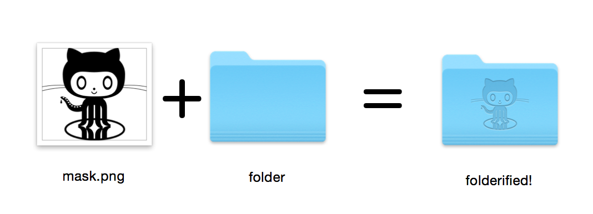

# folderify



Generate pixel-perfect macOS folder icons in the native style.

- Works for macOS 10.5 (Leopard) through 12.0 (Monterey).
- Automatically includes all icon sizes from `16x16` through `512x512@2x`.
- Light or dark mode (automatically selected by default).

**Using `folderify`?** [Let me know](https://twitter.com/lgarron) or [let me know](https://github.com/lgarron/folderify/issues/new) and I'd love to feature some real-world uses!

# Install using [Homebrew](https://formulae.brew.sh/formula/folderify)

```shell
brew install folderify
```

# Usage

Use a mask to assign an icon to a folder:

```shell
folderify mask.png /path/to/folder
```

Generate `mask.icns` and `mask.iconset` files:

```shell
folderify mask.png
```

Generate icon files for a specific version of macOS (the default is your current
version):

```shell
folderify --macOS 11.0 mask.png
```

By default, `folderify` uses your systems's current light/dark mode. Use `--color-scheme` to override this:

```shell
folderify --macOS 11.0 --color-scheme dark mask.png
```

Note:

- There is currently no simple way to set an icon that will automatically switch between light and dark when you switch the entire OS. You can only assign one icon to a folder.
- Dark color scheme is only supported for macOS 11.0 (and later) right now.

## Tips

For best results:

- Use a `.png` mask.
- Use a solid black design over a transparent background.
- Make sure the corner pixels of the mask image are transparent. They are used for empty margins.
- Pass the `--no-trim` flag and use a mask:
  - with a height of 384px,
  - with a width that is a multiple of 128px (up to 768px),
  - using a 16px grid.
  - Each 64x64 tile will exactly align with 1 pixel at the smallest icon size.

# Other installation options

If you don't have Homebrew but you already have ImageMagick (the `convert`
binary) on your system, you can use the following:

## Install using `pip`

```shell
pip install folderify
```

## Download the source code directly

Or download the code directly:

```shell
curl -L https://github.com/lgarron/folderify/archive/main.zip -o folderify-main.zip
unzip folderify-main.zip && cd folderify-main
python -m folderify examples/src/folder_outline.png . --reveal
```

The repository folder should now have a custom icon.

```shell
for file in examples/src/*.png; do python -m folderify $file; done
open examples/src/
```

You should see a bunch of new `.iconset` folders and `.icns` files that were automatically generated from the `.png` masks.

## Dependencies

- [ImageMagick](https://www.imagemagick.org/) - for image processing (you should be able to run <code>convert</code> on the commandline).
- Included with macOS:
  - Python (version 2 or 3).
  - `iconutil`
- Bundled with `folderify`:
  - [`osxiconutils`](https://github.com/sveinbjornt/osxiconutils), a GPL-licensed project by Sveinbjorn Thordarson (based on [`IconFamily`](http://iconfamily.sourceforge.net/)).
- Optional:
  - `sips`, `DeRez`, `Rez`, `SetFile` (You need XCode command line tools for some of these.)
    - Only used if you use `--set-icon-using Rez` in the arguments.

# Full options

```
usage: folderify [-h] [--reveal] [--macOS VERSION] [--osx VERSION]
                   [--color-scheme COLOR_SCHEME] [--no-trim]
                   [--set-icon-using TOOL] [--verbose]
                   [mask] [target]

Generate a native-style macOS folder icon from a mask file.

positional arguments:
  mask                  Mask image file. For best results:
                        - Use a .png mask.
                        - Use a solid black design over a transparent background.
                        - Make sure the corner pixels of the mask image are transparent. They are used for empty margins.
                        - Make sure the non-transparent pixels span a height of 384px, using a 16px grid.
                          If the height is 384px and the width is a multiple of 128px, each 64x64 tile will exactly align with 1 pixel at the smallest folder size.
  target                Target file or folder. If a target is specified, the resulting icon will be applied to the target file/folder.
                        Else, a .iconset folder and .icns file will be created in the same folder as the mask (you can use "Get Info" in Finder to copy the icon from the .icns file).

optional arguments:
  -h, --help            show this help message and exit
  --reveal, -r          Reveal the target (or resulting .icns file) in Finder.
  --macOS VERSION       Version of the macOS folder icon, e.g. "10.13". Defaults to the version currently running (10.16).
  --osx VERSION, -x VERSION
                        Synonym for the --macOS argument.
  --color-scheme COLOR_SCHEME
                        Color scheme: auto (match current system), light, dark.
  --no-trim             Don't trim margins from the mask. By default, transparent margins are trimmed from all 4 sides.
  --set-icon-using TOOL
                        Tool to used to set the icon of the target: auto (default), seticon, Rez.
                        Rez usually produces a smaller "resource fork" for the icon, but only works if XCode command line tools are already installed and if you're using a folder target.
  --verbose, -v         Detailed output.

```

---

Example generated from the Apple logo:

